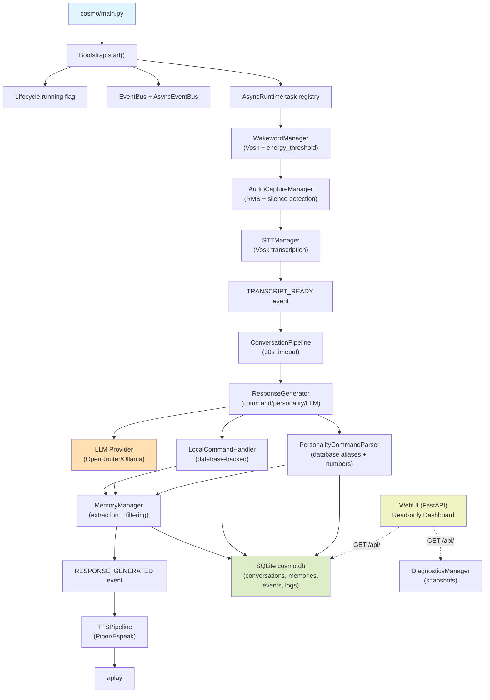
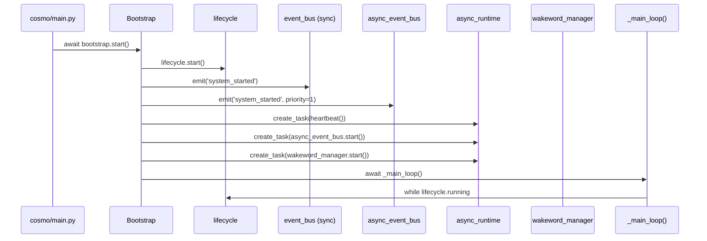
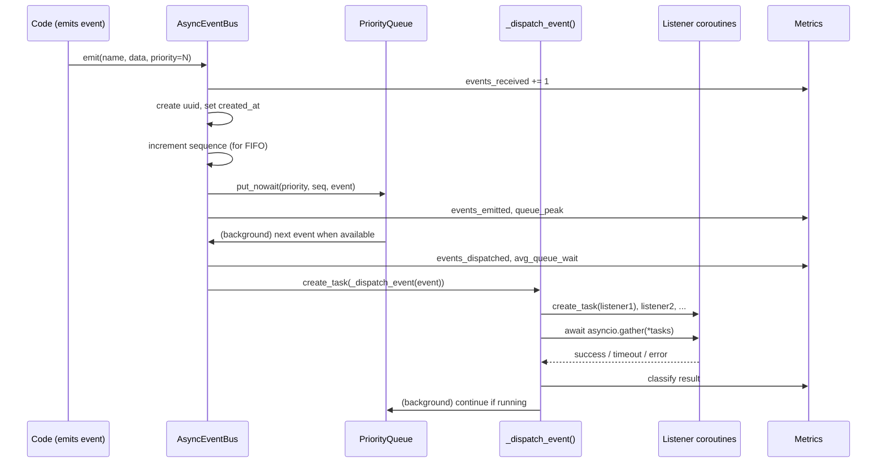
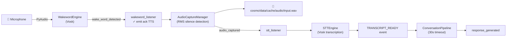
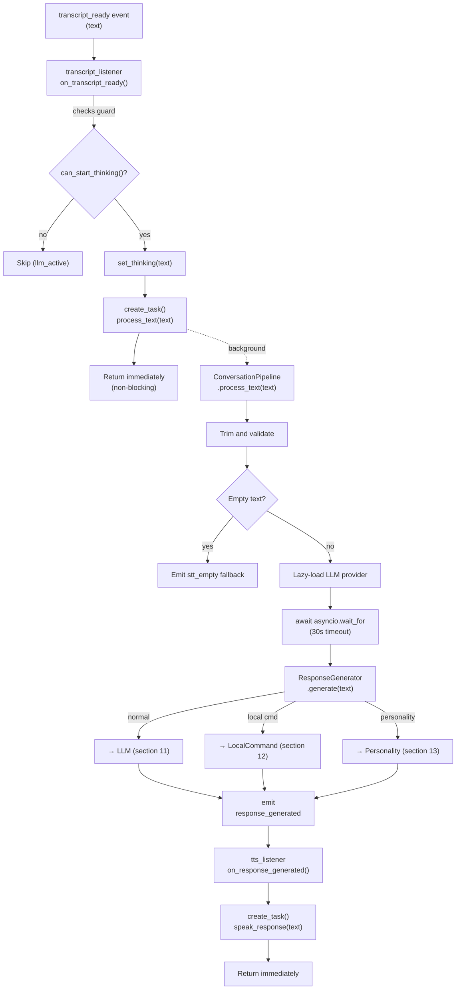
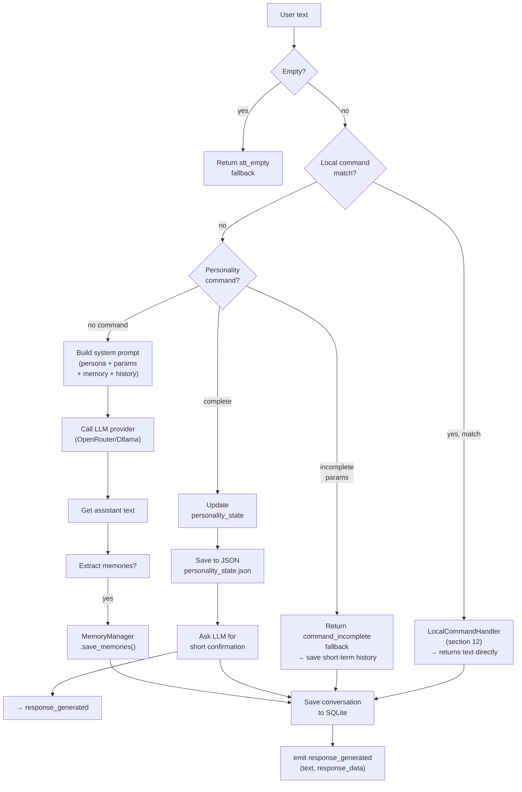
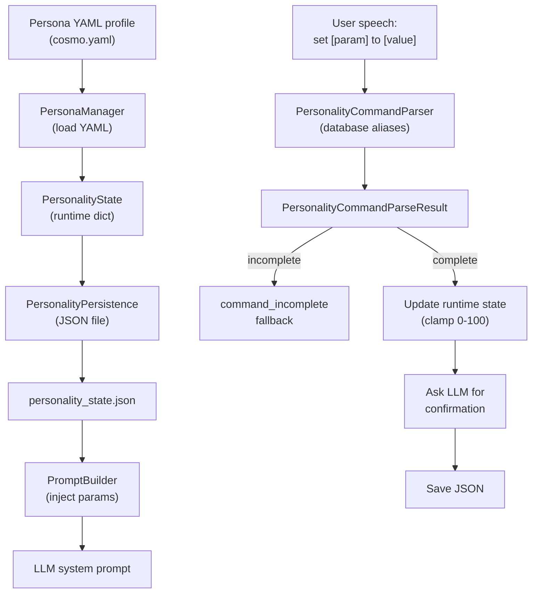
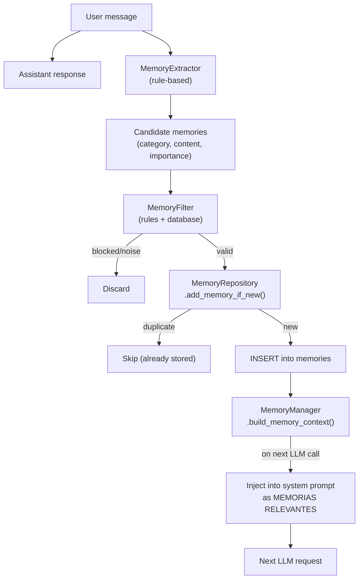
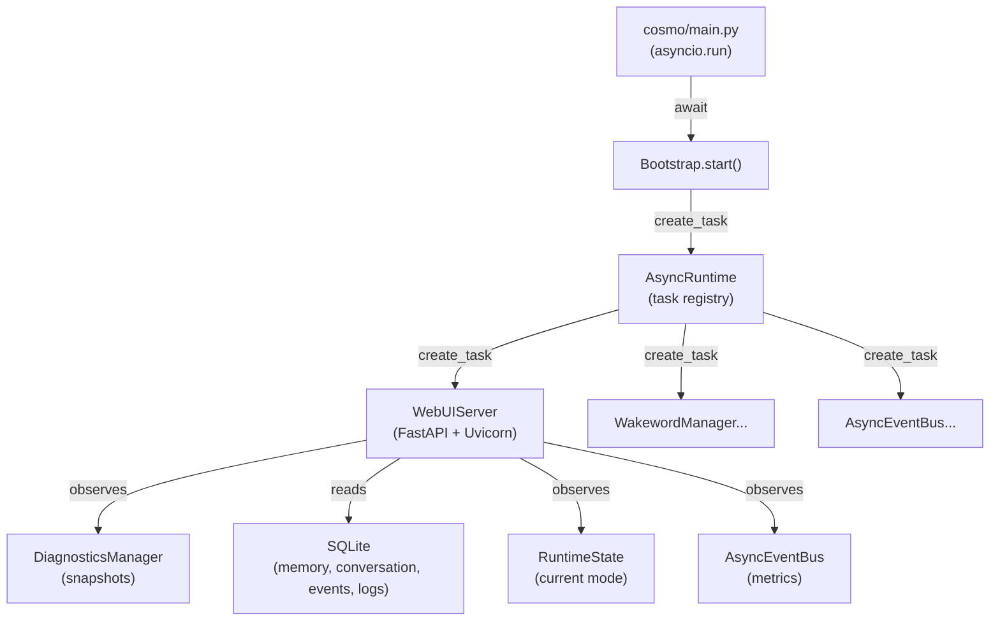

# Zenith Cosmo 42 Project Wiki

**Last Updated:** 2026-06-04  
**Status:** Reflects current implementation as of latest code analysis

## Table of Contents

1. [Project Overview](#1-project-overview)
2. [Current Implementation Status](#2-current-implementation-status)
3. [System Architecture](#3-system-architecture)
4. [Source Code Structure](#4-source-code-structure)
5. [Startup and Bootstrap Flow](#5-startup-and-bootstrap-flow)
6. [Runtime State Management](#6-runtime-state-management)
7. [Async Event System](#7-async-event-system)
8. [Audio Pipeline](#8-audio-pipeline)
9. [Wakeword Optimization](#9-wakeword-optimization)
10. [Conversation Pipeline](#10-conversation-pipeline)
11. [Response Generation](#11-response-generation)
12. [Local Commands](#12-local-commands)
13. [Personality System](#13-personality-system)
14. [Persistent Memory](#14-persistent-memory)
15. [Database and Repository Layer](#15-database-and-repository-layer)
16. [Logging System](#16-logging-system)
17. [Event Persistence](#17-event-persistence)
18. [Diagnostics System](#18-diagnostics-system)
19. [WebUI Observability Dashboard](#19-webui-observability-dashboard)
20. [Configuration Reference](#20-configuration-reference)
21. [Testing and Validation](#21-testing-and-validation)
22. [Troubleshooting](#22-troubleshooting)
23. [Known Limitations](#23-known-limitations)
24. [Pending Roadmap](#24-pending-roadmap)
25. [Development Guidelines](#25-development-guidelines)

## 1. Project Overview

Zenith Cosmo 42 is a local voice assistant runtime featuring:

- **Event-driven architecture** with asynchronous priority queue event bus
- **Offline speech recognition** using Vosk (Kaldi) with Portuguese support
- **Persistent memory** with SQLite-backed repositories for users, conversations, memories, events, and system state
- **Personality system** with runtime parameter adjustment and YAML profile management
- **Local command handling** for deterministic operations without LLM overhead
- **Provider-based TTS** with Piper synthesis and experimental Espeak support
- **WebUI observability** dashboard providing read-only runtime monitoring
- **Lightweight wakeword detection** with energy thresholding and idle optimization
- **Prompt injection** with persona, personality parameters, relevant memories, and conversation history
- **Concurrency protection** for critical paths (wake word, capture, thinking, speaking)

The system language and command vocabulary are primarily Brazilian Portuguese. The application entry point is `cosmo/main.py`, which calls `bootstrap.start()` inside `asyncio.run()`.

## 2. Current Implementation Status

**Implemented Features:**
- ✅ RuntimeStateManager with 7-state machine (idle → wake_detected → listening → transcribing → thinking → speaking → cooldown)
- ✅ Conversation/TTS concurrency protection with guard methods
- ✅ Local fallbacks standardized across error paths
- ✅ ConversationManager history limit (10 messages)
- ✅ Safe handling of incomplete personality commands with fallback responses
- ✅ Lightweight persona/personality parameter persistence (JSON state file)
- ✅ Persistent memory with SQLite repositories (users, memories, conversations, events, faces, system_state, local_commands, personality metadata)
- ✅ WebUI as read-only observability dashboard inside Cosmo process
- ✅ SQLite database layer with repository pattern for data access
- ✅ Async event bus with priority queue and metrics collection
- ✅ Wakeword energy optimization with idle sleep and silence grace
- ✅ Logging to both console and SQLite
- ✅ Event persistence to SQLite EventRepository
- ✅ Diagnostics/runtime snapshots via DiagnosticsManager
- ✅ Database-backed local commands with fallback phrases
- ✅ Database-backed personality command aliases and number words
- ✅ Provider-based TTS factory with Piper and Espeak implementations
- ✅ Vosk wakeword detection with continuous monitoring

**Pending Features:**
- 📋 Vision system (placeholder directories exist, no implementation)
- 📋 Robotic abstraction layer
- 📋 API, CLI, WebSocket interfaces (placeholder directories)
- 📋 Task scheduler/planner (placeholder directories)

## 3. System Architecture



**Core Responsibilities:**

| Component | Path | Purpose |
|---|---|---|
| Entry point | `cosmo/main.py` | Starts async bootstrap |
| Bootstrap | `cosmo/core/bootstrap/bootstrap.py` | Initializes lifecycle, imports listeners, starts event bus and wakeword task |
| Runtime state | `cosmo/core/runtime/runtime_state.py` | 7-state machine; guards wake, capture, thinking, speaking |
| Async event bus | `cosmo/core/events/async_event_bus.py` | Priority queue, listener dispatch, metrics, resilience |
| Wakeword | `cosmo/audio/wakeword/` | Vosk-based word detection with energy thresholding |
| Audio capture | `cosmo/audio/capture/audio_capture_manager.py` | Records user speech with RMS silence detection |
| STT | `cosmo/audio/stt/` | Vosk transcription engine |
| Conversation | `cosmo/cognition/conversation/` | Short-term history and pipeline orchestration |
| Response generation | `cosmo/cognition/response/response_generator.py` | Command/personality/LLM routing |
| TTS | `cosmo/audio/tts/` | Provider-based synthesis (Piper/Espeak) |
| Memory | `cosmo/cognition/memory/` | Rule-based extraction, filtering, persistence |
| Database | `cosmo/data/database/` | SSQLite connection and repository classes |
| Diagnostics | `cosmo/data/diagnostics/diagnostics_manager.py` | Runtime snapshots |
| WebUI | `cosmo/interfaces/webui/` | FastAPI observability dashboard |
| Logging | `cosmo/core/logger/` | Console, file, and SQLite handlers |
| Configuration | `cosmo/core/config/` | YAML settings loader |

## 4. Source Code Structure

| Path | Status | Responsibility |
|---|---|---|
| `cosmo/main.py` | ✅ Active | Application entry point |
| `cosmo/core/bootstrap/` | ✅ Active | Lifecycle startup and listener registration |
| `cosmo/core/events/` | ✅ Active | Event types, buses, and listener modules |
| `cosmo/core/runtime/` | ✅ Active | Runtime state machine, task registry, thread helpers |
| `cosmo/core/config/` | ✅ Active | YAML settings loader |
| `cosmo/core/logger/` | ✅ Active | Console, file, and SQLite log handlers |
| `cosmo/core/commands/` | ✅ Active | Local command parser with database fallback |
| `cosmo/core/fallback/` | ✅ Active | Fallback response text and messages |
| `cosmo/audio/wakeword/` | ✅ Active | Vosk word detection with energy optimization |
| `cosmo/audio/capture/` | ✅ Active | Audio recording with RMS silence detection |
| `cosmo/audio/stt/` | ✅ Active | Vosk STT engine and manager |
| `cosmo/audio/tts/` | ✅ Active | Provider factory with Piper and Espeak implementations |
| `cosmo/audio/vad/` | ⚠️ Present | WebRTC VAD wrapper (not used; capture uses RMS) |
| `cosmo/cognition/conversation/` | ✅ Active | ConversationManager with 10-message deque |
| `cosmo/cognition/response/` | ✅ Active | Response generation pipeline |
| `cosmo/cognition/personality/` | ✅ Active | Persona profiles, runtime parameters, JSON persistence |
| `cosmo/cognition/memory/` | ✅ Active | Memory extraction, filtering, SQLite repositories |
| `cosmo/data/database/` | ✅ Active | SQLite connection and repository classes |
| `cosmo/data/diagnostics/` | ✅ Active | Runtime snapshot generation |
| `cosmo/interfaces/webui/` | ✅ Active | FastAPI app with 9 endpoints |
| `cosmo/models/` | ✅ Runtime assets | Vosk and Piper model directories |
| `cosmo/tests/` | ✅ Active | 19+ test/validation scripts |
| `cosmo/vision/`, `cosmo/cognition/planner/`, etc. | 📋 Placeholder | Empty directories for future expansion |

## 5. Startup and Bootstrap Flow

Startup sequence begins in `cosmo/main.py`:

```python
import asyncio
from cosmo.core.bootstrap.bootstrap import bootstrap

if __name__ == "__main__":
    asyncio.run(bootstrap.start())
```

Bootstrap flow (`bootstrap.py`):



**Listener Registration** happens through import side effects in `bootstrap.py`:

| Module | Bus | Event | Handler |
|---|---|---|---|
| `system_listener.py` | sync | `system_started` | `on_system_started` |
| `system_async_listener.py` | async | `system_started` | `on_system_started` |
| `wakeword_listener.py` | async | `wake_word_detected` | `on_wake_word_detected` |
| `stt_listener.py` | async | `audio_captured` | `on_audio_captured` |
| `transcript_listener.py` | async | `transcript_ready` | `on_transcript_ready` |
| `tts_listener.py` | async | `response_generated` | `on_response_generated` |
| `conversation_listener.py` | sync | `command_received` | `on_command_received` (legacy) |
| `vision_listener.py` | sync | `user_recognized`, `face_unknown` | (vision not implemented) |

**Shutdown** sequence (`Bootstrap.shutdown()`):
1. Sets `lifecycle.running = False`
2. Emits `system_shutdown` on sync bus
3. Calls `async_runtime.shutdown()` (cancels tracked tasks)
4. Logs completion

## 6. Runtime State Management

The runtime uses a **7-state machine** to prevent duplicate operations and coordinate state transitions:

```mermaid
stateDiagram-v2
    [*] --> idle
    
    idle --> wake_detected: set_wake_detected()
    idle --> error: set_error()
    
    wake_detected --> listening: set_listening()
    wake_detected --> error: set_error()
    
    listening --> transcribing: set_transcribing()
    listening --> error: set_error()
    
    transcribing --> thinking: set_thinking(text)
    transcribing --> error: set_error()
    
    thinking --> speaking: set_speaking(response)
    thinking --> error: set_error()
    
    speaking --> cooldown: set_cooldown(seconds)
    speaking --> error: set_error()
    
    cooldown --> idle: set_idle()
    cooldown --> error: set_error()
    
    error --> idle: set_idle()
    
    idle -.->|ignored| wake_detected
    wake_detected -.->|ignored| wake_detected
    listening -.->|ignored| listening
    transcribing -.->|ignored| transcribing
    thinking -.->|ignored| thinking
    speaking -.->|ignored| speaking
    cooldown -.->|ignored| listening
```

**State Guard Methods:**

| Guard | Returns |
|---|---|
| `should_ignore_wakeword()` | True if mode is not `idle` OR current time < `ignore_wakeword_until` |
| `can_start_thinking()` | True if mode is `idle` or `transcribing` |
| `snapshot()` | Dict with full runtime state (mode, flags, timestamps, text, counters) |
| `mark_heartbeat()` | Increments `heartbeat_count` and updates `last_heartbeat_at` |
| `heartbeat_alive()` | True if heartbeat was updated within last 10 seconds |
| `uptime_seconds()` | Number of seconds since runtime started |

**State Side Effects:**

| Mode | Side effects |
|---|---|
| `idle` | Clears `tts_active`, `llm_active`, `capture_active`, `current_transcript`, `current_response`, any previous error |
| `wake_detected` | Records transition reason |
| `listening` | Sets `capture_active = True` |
| `transcribing` | Sets `capture_active = False` |
| `thinking` | Sets `llm_active = True`, stores `current_transcript` |
| `speaking` | Sets `llm_active = False`, `tts_active = True`, stores `current_response` |
| `cooldown` | Sets `tts_active = False`, sets `ignore_wakeword_until = now + cooldown_seconds` |
| `error` | Stores `last_error` string |

## 7. Async Event System

The **AsyncEventBus** is the core dispatch mechanism for all active audio, STT, cognition, and TTS flow. It uses a **priority queue** to ensure critical events are processed first while respecting FIFO order within each priority level.

**Priority Levels (0=highest):**

| Level | Constant | Category |
|---|---|---|
| 0 | `PRIORITY_CRITICAL` | Critical/shutdown events |
| 1 | `PRIORITY_AUDIO` | Wake word, capture, STT |
| 2 | `PRIORITY_CONVERSATION` | Conversation-level events |
| 3 | `PRIORITY_COGNITION` | LLM/response generation |
| 5 | `PRIORITY_BACKGROUND` | Default/background tasks |

**Event Lifecycle:**



**Queue Behavior:**

| Parameter | Value | Meaning |
|---|---|---|
| Max queue size | 100 | Queue full triggers `QueueFull` (logs warning, increments `events_dropped`) |
| Listener timeout | 30 seconds | Enforced per listener; triggers fallback TTS for transcript/audio/response events |
| Concurrent listeners | All | Listeners for same event run in parallel with `asyncio.gather()` |

**Key Event Metrics:**

Exposed in `async_event_bus.get_metrics()`:

```python
{
    "events_received": int,           # Total emitted
    "events_emitted": int,             # Queued
    "events_dispatched": int,          # Started dispatch
    "events_completed": int,           # All listeners succeeded
    "events_failed": int,              # All listeners failed
    "events_partial_failure": int,     # Mixed success/failure
    "events_unhandled": int,           # No listeners registered
    "events_dropped": int,             # Queue full
    "listener_timeouts": int,          # Listeners that timed out
    "listener_errors": int,            # Listeners that raised exceptions
    "queue_current_size": int,         # Current queue length
    "queue_peak_size": int,            # Highest queue size observed
    "avg_queue_wait_time": float,      # Average seconds in queue
    "avg_event_processing_time": float # Average dispatch-to-complete time
}
```

## 8. Audio Pipeline

The audio data flow from microphone to conversation:



**Wakeword Detection (`WakewordManager`):**

- Runs continuously in background task
- Reads chunks from PyAudio stream
- Calls `wakeword_engine.process_audio(chunk)`
- On detection: emits `wake_word_detected` event (priority AUDIO)
- Guard: skips reading if `runtime_state.should_ignore_wakeword()` is true (sleep 0.1s)
- Optimization: configurable `idle_sleep` (default 0.03s) between reads during IDLE

**Audio Capture (`AudioCaptureManager`):**

- Triggered by `wakeword_listener.on_wake_word_detected()`
- Records microphone to temporary WAV file
- Uses RMS silence detection: `audioop.rms(data, 2) < silence_threshold`
- Stops on: silence_timeout (default 1.5s) OR max_record_seconds (default 30s)
- Emits `audio_captured` event with file path

**Speech-to-Text (`STTEngine`):**

- Called by `stt_listener.on_audio_captured()`
- Opens WAV file with `wave.open()`
- Creates Vosk `KaldiRecognizer` and feeds 4000-byte frames
- Returns `FinalResult()["text"].strip()`
- Emits `transcript_ready` with normalized text

**Audio Configuration** (from `settings.yaml`):

```yaml
audio:
  sample_rate: 16000        # Hz
  channels: 1               # mono
  chunk_size: 2048          # frames per PyAudio read
  silence_threshold: 500    # RMS value
  silence_timeout: 1.5      # seconds of silence before stopping
  max_record_seconds: 30    # hard limit for capture
```

## 9. Wakeword Optimization

The wakeword detector is the most CPU-intensive component during idle periods. Cosmo implements several optimizations:

**Energy-Based Gating:**

```yaml
wakeword:
  energy_threshold: 250     # RMS energy threshold
  idle_sleep: 0.03          # seconds to sleep when idle (no speech)
```

The wakeword engine can optionally gate audio processing based on RMS energy:
- Only process Vosk `AcceptWaveform()` when RMS > `energy_threshold`
- Skip Vosk processing during silent periods to reduce CPU
- Configurable via settings; fallback to continuous processing if not enabled

**Idle Sleep:**

- After each no-speech chunk, sleep `idle_sleep` (default 0.03s)
- Reduces busy-waiting CPU usage
- Can be tuned based on responsiveness vs. CPU consumption
- Longer sleep = lower idle CPU, higher latency to wake word

**Silence Grace Chunks** (config option):

```yaml
wakeword:
  silence_grace_chunks: 5   # (optional, tunable)
```

- Skip Vosk processing for N chunks of silence
- Allows brief pauses in natural speech without re-triggering wakeword
- Reduces false positives from pause in user's utterance

**Runtime Guard:**

```python
if runtime_state.should_ignore_wakeword():
    await asyncio.sleep(0.1)
    continue
```

- When system is not `idle` (listening, thinking, speaking, etc.), wakeword task sleeps briefly
- Prevents wakeword processing while other operations are active

**High Idle CPU Troubleshooting:**

If idle CPU is high (> 20%), it's typically Vosk `AcceptWaveform()` in continuous loop:

1. Enable/increase `energy_threshold` to gate low-volume noise (reduces Vosk processing)
2. Increase `idle_sleep` from default 0.03s to 0.05-0.1s (adds delay but reduces loop frequency)
3. Tune `chunk_size`:
   - Larger chunk_size (e.g., 2048 → 4096) = fewer loop iterations = lower CPU, but higher wakeword latency
   - Smaller chunk_size (e.g., 2048 → 512) = more loop iterations = higher CPU, but faster wakeword response
4. Enable `silence_grace_chunks` if available to skip Vosk processing during silence periods

## 10. Conversation Pipeline

The **ConversationPipeline** orchestrates the complete user text → response flow, with a 30-second timeout and non-blocking listener pattern.

**Flow:**



**ConversationManager** (short-term history):

- Maintains `deque(maxlen=10)` of `{"role": "user"/"assistant", "content": text}`
- Populated by `ResponseGenerator` for each user input and assistant response
- Used as context in LLM prompts (injected after system prompt, before user message)
- Limited to recent 10 exchanges to keep context window manageable

**Timeout Handling (30s):**

- Catches `asyncio.TimeoutError`
- Emits LLM error fallback response via `fallback_manager.llm_error()`

## 11. Response Generation

**ResponseGenerator** is the central decision point that routes text to local commands, personality adjustments, or LLM calls.

**Decision Tree:**



**Key Decision Points:**

1. **Empty check:** Skip if `not user_text.strip()`
2. **Local command check:** `LocalCommandParser.parse(text)` returns intent or None
3. **Personality command check:** `PersonalityCommandParser.parse(text)` returns `PersonalityCommandParseResult`
4. **LLM check:** For normal text, call provider

**Memory Integration:**

- Memories NOT extracted for: local commands, incomplete personality commands
- Memories extracted for: complete personality commands (via LLM confirmation) and normal LLM responses
- Memories saved by: `MemoryManager.process_interaction(user_text, assistant_text, extract_memories=bool)`

**Prompt Construction:**

For normal LLM calls, `build_messages()` prepends:

1. **System prompt** from `PromptBuilder.build_system_prompt()` containing:
   - Persona identity and profile text
   - Current personality parameters (0-100 scales)
   - Derived style rules based on thresholds
   - Example dialogue
   - Portuguese language directive + no Markdown directive

2. **Memory context** (if available) as separate system message:
   - Format: "- [category] content\n..." (max 5 memories)

3. **Conversation history** from `ConversationManager`:
   - Last 10 exchanges in format: `{"role": "user"/"assistant", "content": "..."}`

4. **User message**:
   - `{"role": "user", "content": user_text}`

**LLM Providers:**

- **OpenRouter**: `cosmo/ai/llm/providers/openrouter_provider.py`
  - Requires `OPENROUTER_API_KEY` environment variable
  - Sends messages list
  - Supports streaming and non-streaming
  
- **Ollama**: `cosmo/ai/llm/providers/ollama_provider.py`
  - Local inference server (default: `http://localhost:11434`)
  - Sends messages list
  - Synchronous (blocking)

**TTS Fallback:**

If response text is empty or error occurs, `fallback_manager` returns mode-appropriate message:
- Thinking: "Deixa eu pensar..."
- Speaking: "Um momento..."
- Cooldown: "Um segundinho..."

## 12. Local Commands

Local commands bypass the LLM entirely and return hardcoded or database-backed responses.

**Parser** (`LocalCommandParser` in `cosmo/core/commands/local_command_parser.py`):

1. Lowercases input text
2. Removes accents with `unidecode`
3. Queries `local_commands` table for matching phrase (normalized equality)
4. Falls back to in-code hardcoded phrases if database lookup fails

**Supported Intents and Handlers:**

| Intent | Phrase examples | Handler | Returns |
|---|---|---|---|
| `system_status` | "como você está", "qual seu status" | `_system_status()` | Compact diagnostics (DiagnosticsManager.compact_snapshot) |
| `memory_list` | "quais minhas memórias", "liste memórias" | `_memory_list()` | Recent 10 memories from database |
| `memory_clear` | "limpe memórias", "apague histórico" | `_memory_clear()` | Deletes all memories for default user |

**Execution Behavior:**

When a local command matches:
1. Handler returns response text
2. Response is NOT passed through LTS (Text-to-Speech) directly
3. `ResponseGenerator.generate()` still:
   - Adds user message to short-term `ConversationManager`
   - Adds handler response to `ConversationManager`
   - Calls `MemoryManager.process_interaction(..., extract_memories=False)` to persist conversation without new memory extraction
   - Emits `response_generated` event
4. `tts_listener` picks up event and synthesizes the response

**Database Records** (cosmo.db):

```sql
CREATE TABLE local_commands (
    id INTEGER PRIMARY KEY,
    intent TEXT,
    phrase TEXT,
    language TEXT,
    active INTEGER,
    created_at TIMESTAMP
);

CREATE UNIQUE INDEX idx_local_commands_intent_phrase
    ON local_commands(intent, phrase);
```

## 13. Personality System

The personality system allows runtime tuning of Cosmo's behavior through 16 adjustable parameters (0-100 scale each).

**Architecture:**



**Default Parameters** (from `cosmo/cognition/personality/profiles/cosmo.yaml`):

```yaml
parameters:
  verbosity: 10              # How much to explain
  humor: 40                  # Joke/sarcasm frequency
  sarcasm: 50                # Sarcastic tone intensity
  honesty: 95                # Truth priority
  empathy: 20                # Emotional awareness
  curiosity: 30              # Question asking
  confidence: 100            # Self-assurance
  formality: 10              # Formal language
  adaptability: 70           # Flexibility to user style
  discipline: 100            # Consistency
  imagination: 10            # Creative thinking
  emotional_stability: 100   # Calmness
  pragmatism: 100            # Practical focus
  optimism: 50               # Positive outlook
  resourcefulness: 95        # Problem-solving
  cheerfulness: 30           # Friendliness
  engagement: 40             # Conversation involvement
  respectfulness: 20         # Deference
```

**Personality Commands:**

Database-backed aliases map spoken words to parameters:

```sql
CREATE TABLE personality_parameter_aliases (
    id INTEGER PRIMARY KEY,
    alias TEXT,              -- "sensibilidade", "empatia"
    parameter TEXT,           -- "empathy"
    language TEXT,
    active INTEGER,
    created_at TIMESTAMP
);

CREATE TABLE number_words (
    id INTEGER PRIMARY KEY,
    word TEXT,                -- "vinte", "oitenta e cinco"
    value INTEGER,            -- 20, 85
    language TEXT,
    active INTEGER,
    created_at TIMESTAMP
);

CREATE TABLE personality_command_words (
    id INTEGER PRIMARY KEY,
    word TEXT,                -- "aumenta", "diminui", "coloca"
    language TEXT,
    active INTEGER,
    created_at TIMESTAMP
);
```

**Parser Logic** (`PersonalityCommandParser.parse(text)`):

1. Normalize: lowercase + remove diacritics
2. Check if any command word is present (`aumenta`, `diminui`, `coloca`, etc.)
3. Find parameter alias match in database (with fallback to in-code aliases)
4. Extract last numeric value (digits or spelled-out number words)
5. Parse compound values (`oitenta e cinco` → 85)
6. Clamp to 0-100
7. Return `PersonalityCommandParseResult` with:
   - `is_complete`: bool (found param + value)
   - `parameter`: str or None
   - `value`: int or None (0-100)

**Persistence:**

- Runtime parameters stored in `PersonalityState` dict
- On update: saved to `cosmo/data/state/personality_state.json`
- On startup: loaded from JSON if `active_profile` matches
- Persisted JSON replaces entire parameter dict (partial save overwrites full YAML defaults)

## 14. Persistent Memory

The memory system extracts, filters, stores, and retrieves conversation facts from SQLite.

**Memory Lifecycle:**



**Memory Extraction** (rule-based, inspects `user_text` only):

| Category | Trigger phrases | Content prefix | Importance |
|---|---|---|---:|
| `preference` | "eu prefiro", "prefiro", "gosto que você", "responda sempre" | "Preferência do usuário:" | 3 |
| `instruction` | "de agora em diante", "sempre que", "quando eu pedir", "nas próximas" | "Instrução persistente:" | 4 |
| `project_fact` | "no projeto cosmo", "o cosmo deve", "arquitetura cosmo" | "Fato sobre Cosmo:" | 3 |
| `explicit` | "lembre que", "guarde que", "salve que", "registre que" | (clean text) | 5 |

**Memory Filtering** (`MemoryFilter.is_valid()`):

Rejects if:
- Content length < 12 characters (configurable)
- Contains blocked terms (passwords, medical data, religion, politics, personal documents, etc.)
- Exactly matches noise markers (filler words, cancel phrases)

**Memory Storage:**

```sql
CREATE TABLE memories (
    id INTEGER PRIMARY KEY,
    user_id INTEGER,
    category TEXT,
    content TEXT,
    importance INTEGER,
    created_at TIMESTAMP,
    FOREIGN KEY(user_id) REFERENCES users(id)
);
```

**Duplicate Prevention:**

`add_memory_if_new()` checks if memory with same `lower(content)` already exists for user; skips insert if match found.

**Memory Retrieval:**

`build_memory_context(user_text, limit=5)`:
- Queries memories ordered by `importance DESC, created_at DESC`
- Returns up to 5 formatted as: `- [category] content`
- Currently ignores `user_text` for semantic ranking
- Injected as separate system message in LLM calls

**Local Memory Commands:**

- `memory_list`: Returns recent 10 memories via local command handler
- `memory_clear`: Deletes all memories for default user; non-reversible

## 15. Database and Repository Layer

SQLite is the central persistence mechanism with **11 repository classes** providing CRUD access.

**Database Setup:**

```python
# cosmo/data/database/database.py
db = Database()

# Connection parameters:
database_path = "cosmo/data/database/cosmo.db"
row_type = sqlite3.Row
foreign_keys = ON
journal_mode = WAL
synchronous = NORMAL
```

**Schema Overview:**

```mermaid
erDiagram
    users ||--o{ memories : has
    users ||--o{ conversations : has
    users ||--o{ faces : has
    
    events {
        integer id PK
        text type
        text payload
        timestamp created_at
    }
    
    system_state {
        text key PK
        text value
    }
    
    local_commands {
        integer id PK
        text intent
        text phrase
        text language
        integer active
        timestamp created_at
    }
    
    personality_parameter_aliases {
        integer id PK
        text alias
        text parameter
        text language
        integer active
        timestamp created_at
    }
    
    number_words {
        integer id PK
        text word
        integer value
        text language
        integer active
        timestamp created_at
    }
    
    personality_command_words {
        integer id PK
        text word
        text language
        integer active
        timestamp created_at
    }
    
    memory_blocked_terms {
        integer id PK
        text term
        text language
        integer active
        timestamp created_at
    }
    
    memory_noise_markers {
        integer id PK
        text marker
        text language
        integer active
        timestamp created_at
    }
    
    memory_filter_settings {
        text key PK
        text value
    }
    
    logs {
        integer id PK
        text level
        text logger_name
        text message
        timestamp created_at
    }
```



**Repository Types:**

| Repository | Path | Tables | Key methods |
|---|---|---|---|
| **UserRepository** | `repositories/user_repository.py` | users | `get_or_create_user()`, `get_user_by_id()`, `get_user_by_name()`, `update_last_seen()`, `update_trust_level()` |
| **ConversationRepository** | `repositories/conversation_repository.py` | conversations | `add_message()`, `get_recent_conversation_context()`, `clear_history()` |
| **MemoryRepository** | `repositories/memory_repository.py` | memories | `add_memory()`, `add_memory_if_new()`, `get_recent_memories()`, `get_memories_by_category()`, `memory_exists()` |
| **EventRepository** | `repositories/event_repository.py` | events | `emit_event()`, `get_recent_events()` |
| **SystemRepository** | `repositories/system_repository.py` | system_state | `set_state()`, `get_state()`, `delete_state()` |
| **FaceRepository** | `repositories/face_repository.py` | faces | `create_face()`, `get_faces_by_user()`, `delete_face()` |
| **LocalCommandRepository** | `repositories/local_command_repository.py` | local_commands | `get_active_commands()`, `add_command_phrase()`, `disable_command_phrase()` |
| **PersonalityCommandRepository** | `repositories/personality_command_repository.py` | personality_parameter_aliases, number_words, personality_command_words | `get_active_parameter_aliases()`, `get_active_number_words()`, `get_active_command_words()` |
| **MemoryFilterRepository** | `repositories/memory_filter_repository.py` | memory_blocked_terms, memory_noise_markers, memory_filter_settings | `get_blocked_terms()`, `get_noise_markers()`, `get_setting()` |
| **LogRepository** | `repositories/log_repository.py` | logs | `add_log()`, `get_recent_logs()` |
| **DatabaseMetricsRepository** | `repositories/database_metrics_repository.py` | database_metrics | Tracks database performance metrics |

## 16. Logging System

Cosmo logs to console, file, and SQLite simultaneously.

**LoggerManager** (`cosmo/core/logger/logger_manager.py`):

```python
logger_name = "cosmo"
file_path = "cosmo/data/logs/cosmo.log"
sqlite_db = "cosmo/data/database/cosmo.db" (logs table)
format = "[timestamp] [level] [name] message"
```

**Handlers:**

1. **Console**: INFO level and above
2. **File**: DEBUG level and above, writes to `cosmo/data/logs/cosmo.log`
3. **SQLite**: DEBUG level (optional, if `logs.sqlite_enabled` is not False)

**Config** (from `settings.yaml`):

```yaml
logs:
  level: DEBUG              # Logger level
  path: cosmo/data/logs/cosmo.log
  sqlite_enabled: true
```

**SQLite Log Table:**

```sql
CREATE TABLE logs (
    id INTEGER PRIMARY KEY,
    level TEXT,
    logger_name TEXT,
    message TEXT,
    created_at TIMESTAMP
);
```

**Async Event Bus Tracing:**

The async event bus emits lifecycle trace messages:

| Trace | Meaning |
|---|---|
| `queued [uuid]` | Event accepted into queue |
| `queue_wait [uuid] [seconds]` | Time between creation and dispatch |
| `high_queue_latency [uuid]` | Queue wait exceeded 5 seconds |
| `dispatched [uuid]` | Event dispatch task started |
| `listener_started [uuid] [listener_name]` | Listener coroutine started |
| `listener_finished [uuid] [listener_name]` | Listener completed (success) |
| `listener_timeout [uuid] [listener_name]` | Listener exceeded 30s timeout |
| `listener_error [uuid] [listener_name]` | Listener raised exception |
| `event_completed [uuid]` | All listeners succeeded |
| `event_failed [uuid]` | All listeners failed |
| `event_partial_failure [uuid]` | Mixed success/failure |

## 17. Event Persistence

Cosmo persists certain events to SQLite through the **EventRepository** for a durable audit trail.

**Automatic Persistence:**

When AsyncEventBus dispatches events, certain event types are automatically persisted by importing EventRepository:
- The async_event_bus imports and uses event_repository internally
- Not all events are persisted; the current implementation persists specific event types to the `events` table

**Event Table:**

```sql
CREATE TABLE events (
    id INTEGER PRIMARY KEY,
    type TEXT,
    payload TEXT,              -- JSON
    created_at TIMESTAMP
);
```

**Manual Event Logging:**

Additionally, code can explicitly log events:

```python
from cosmo.data.database.repositories.event_repository import event_repository

event_repository.emit_event(
    type="user_spoke",
    payload={
        "text": "hello cosmo",
        "confidence": 0.95,
        "duration_ms": 1200
    }
)
```

**Retrieval:**

```python
recent = event_repository.get_recent_events(limit=50)
for row in recent:
    print(f"{row['type']} at {row['created_at']}: {row['payload']}")
```

## 18. Diagnostics System

**DiagnosticsManager** (`cosmo/data/diagnostics/diagnostics_manager.py`) provides snapshots of runtime state:

**Full Snapshot** (`snapshot()`):

```python
{
    "timestamp": "2026-06-04T12:00:00Z",  # UTC ISO format
    "runtime": {
        "mode": "speaking",
        "previous_mode": "thinking",
        "tts_active": True,
        "llm_active": False,
        "capture_active": False,
        "current_transcript": "olá cosmo",
        "current_response": "Olá! Como posso ajudá-lo?",
        "last_error": None,
        "ignore_wakeword_until": 1717502000.0,
        "heartbeat_count": 42
    },
    "event_bus": {
        "events_received": 1234,
        "events_emitted": 1234,
        "events_dispatched": 1233,
        "events_completed": 1200,
        "events_failed": 5,
        "events_partial_failure": 28,
        "events_unhandled": 0,
        "events_dropped": 0,
        "listener_timeouts": 3,
        "listener_errors": 2,
        "queue_current_size": 0,
        "queue_peak_size": 15,
        "avg_queue_wait_time": 0.002,
        "avg_event_processing_time": 0.018
    },
    "conversation": {
        "size": 3,
        "max_size": 10,
        "last_message": "Cosmo: Claro!"
    },
    "personality": {
        "verbosity": 10,
        "humor": 40,
        "sarcasm": 50,
        ... (15 more parameters)
    }
}
```

**Compact Snapshot** (`compact_snapshot()`):

Used by local `system_status` command; flatter structure:

```python
{
    "mode": "speaking",
    "previous_mode": "thinking",
    "tts_active": True,
    "llm_active": False,
    "capture_active": False,
    "conversation_size": 3,
    "queue_size": 0,
    "events_received": 1234,
    "events_completed": 1200,
    "events_failed": 5,
    "listener_timeouts": 3,
    "listener_errors": 2,
    "last_error": None
}
```

**Heartbeat:**

- Emitted periodically (background task in AsyncRuntime)
- Increments `heartbeat_count` in snapshot
- Used to monitor runtime liveness (if count stops incrementing, system frozen)

## 19. WebUI Observability Dashboard

Cosmo runs an embedded **FastAPI** WebUI for real-time runtime observation. The WebUI is **read-only by design**; no destructive actions are exposed.

**WebUI Architecture:**

The WebUI server runs inside the same Cosmo process:



**Endpoint Reference:**

| Endpoint | Method | Response | Purpose |
|---|---|---|---|
| `/` | GET | HTML (Jinja2) | Main dashboard |
| `/api/status/compact` | GET | JSON snapshot | Current mode, flags, queue size, metrics |
| `/api/status/stream` | GET | Server-Sent Events | Streaming compact snapshots (1/sec) |
| `/api/memories` | GET | JSON array | Filter by limit, category, search text |
| `/api/conversations` | GET | JSON array | Filter by limit, role (user/assistant), search |
| `/api/events` | GET | JSON array | Recent events from EventRepository |
| `/api/logs` | GET | JSON array | Recent logs from LogRepository |
| `/static/css/webui.css` | GET | CSS | Dashboard stylesheet |
| `/static/js/webui.js` | GET | JavaScript | Frontend logic |

**Example Requests:**

```bash
# Compact snapshot (single call)
curl http://127.0.0.1:8765/api/status/compact | jq .

# Streaming status (SSE, updates every 1 second)
curl http://127.0.0.1:8765/api/status/stream

# List memories (filtered)
curl http://127.0.0.1:8765/api/memories?limit=20&category=preference

# List conversations (search)
curl "http://127.0.0.1:8765/api/conversations?search=cosmo&role=user"

# Recent events
curl http://127.0.0.1:8765/api/events?limit=50

# Recent logs
curl http://127.0.0.1:8765/api/logs?limit=100

# Static assets
curl http://127.0.0.1:8765/static/css/webui.css
```

**Configuration** (from `settings.yaml`):

```yaml
webui:
  enabled: true
  host: 0.0.0.0           # Accessible from all interfaces
  port: 8765
```

**Static Files:**

Located at `cosmo/interfaces/webui/static/`:

- `css/webui.css` — Dashboard styling
- `js/webui.js` — Frontend interactivity
- `templates/index.html` — HTML template (loaded via Jinja2)

**Key Dashboard Features:**

- **Runtime Card**: Current mode, active flags, transcript, response, error
- **Event Bus Card**: Event metrics (received, dispatched, completed, failed, dropped, timeouts)
- **System Performance Card**: CPU, RAM, disk, temperature, network
- **Cosmo Process Card**: PID, uptime, threads, memory usage
- **Alerts Card**: Error conditions, high queue size, listener timeouts
- **Data Store Card**: Memory count, conversation count, event count, log count

**Inspector Views:**

- **Status Inspector**: Full snapshot of runtime state
- **Memories Inspector**: List/search/filter memories by category
- **Conversations Inspector**: List/search/filter conversation history
- **Events Inspector**: View persisted event log
- **Logs Inspector**: View application logs

**Read-Only Constraints:**

- No POST/DELETE/PATCH endpoints for destructive actions
- No ability to modify personality, clear data, or shutdown from WebUI
- Mutations happen only through voice commands (local commands, personality commands) or direct database access
- Designed for observability, not control

**LAN Accessibility:**

If `webui.host: 0.0.0.0` (default), the dashboard is accessible from any machine on the LAN:

```bash
# From another computer on the network
curl http://<cosmo_ip>:8765/api/status/compact
```

## 20. Configuration Reference

All runtime configuration is YAML-driven and loaded from `cosmo/core/config/settings.yaml`.

**Complete Settings Template:**

```yaml
system:
  name: Zenith Cosmo 42
  codename: ZC-42
  language: pt-BR
  debug: true

personality:
  enabled: true
  active_profile: "cosmo"
  profiles_path: "cosmo/cognition/personality/profiles"

llm:
  provider: "openrouter"              # or "ollama"
  model: "openai/gpt-oss-120b:free"
  temperature: 0.4                    # 0=deterministic, 1=creative
  max_tokens: 512
  timeout: 30                         # seconds

audio:
  sample_rate: 16000
  channels: 1
  chunk_size: 2048
  silence_threshold: 500              # RMS value
  silence_timeout: 1.5                # seconds
  max_record_seconds: 30

wakeword:
  enabled: true
  words:
    - cosmo
    - cosmos
    - cosme
    - zenith
    - zênite
  energy_threshold: 250               # RMS energy gate
  idle_sleep: 0.03                    # seconds sleep when idle

tts:
  engine: piper                        # or "espeak"
  language: pt
  locale: pt_BR
  model: faber/medium/pt_BR-faber-medium
  voice: pt-br
  speed: 145
  pitch: 35
  volume: 120

vision:
  camera_index: 0
  width: 640
  height: 480
  grayscale: true

face_recognition:
  confidence_threshold: 70

memory:
  max_conversation_history: 20        # (currently hardcoded to 10)

database:
  path: data/database/cosmo.db        # (currently not used by Database)

logs:
  level: DEBUG
  path: cosmo/data/logs/cosmo.log
  sqlite_enabled: true

webui:
  enabled: true
  host: 0.0.0.0
  port: 8765
```

**Environment Variables:**

- `OPENROUTER_API_KEY`: Required for OpenRouter LLM provider (no default)
- `.env` file support: `load_dotenv()` called at bootstrap import time

**Configuration Access in Code:**

```python
from cosmo.core.config.settings_manager import config

# Nested access with defaults
sample_rate = config.get("audio", "sample_rate", default=16000)
wakeword_words = config.get("wakeword", "words", default=[])
```

## 21. Testing and Validation

Validation uses a mix of automated test scripts and manual operational checks.

**Test Scripts** (run directly with `python`):

| Script | Purpose | Dependencies |
|---|---|---|
| `test_database.py` | Repository CRUD operations | SQLite |
| `test_memory_manager.py` | Memory extraction, filtering, deduplication | SQLite, extractor rules |
| `test_memory_filter.py` | Database-backed memory filter rules | SQLite, filter rules |
| `test_response_generator_memory_integration.py` | LLM response → memory extraction → prompt injection | LLM provider, memory system |
| `test_local_memory_commands.py` | Memory list/clear commands | SQLite, memory repo |
| `test_local_command_db.py` | Database-backed local command parsing | SQLite, local command phrases |
| `test_local_status_command.py` | System status command diagnostics | Diagnostics manager |
| `test_persona_command_parser.py` | Personality parameter parsing (aliases, numbers, compound values) | Database personality aliases |
| `test_persona_command_integration.py` | Personality command → state update → LLM confirmation → persistence | LLM provider, personality system |
| `test_persona_persistance.py` | Personality JSON save/load and profile mismatch | Personality persistence |
| `test_conversation_manager.py` | Short-term conversation deque (max 10, ordering) | ConversationManager |
| `test_runtime_state.py` | Runtime state transitions (idle → wake → listen → transcribe → think → speak → cooldown) | RuntimeState |
| `test_concurrency_guards.py` | Duplicate transcript guard, duplicate TTS guard | RuntimeState guards |
| `test_transcript_pipeline.py` | Transcript listener returns quickly; processing in background | ConversationPipeline |
| `test_tts_pipeline.py` | TTS listener returns quickly; speaking in background | TTSPipeline (requires Piper + aplay) |
| `test_fallback_manager.py` | Fallback response text and mode-aware busy messages | FallbackManager |
| `test_diagnostics_manager.py` | Full and compact snapshot structure | DiagnosticsManager |
| `test_event_bus_metrics.py` | Event bus metrics under normal, timeout, and error listeners | AsyncEventBus |
| `priority_test.py` | Priority queue ordering, FIFO, starvation, overflow | AsyncEventBus |
| `critical_event_test.py` | Critical priority event dispatch during background flood | AsyncEventBus |
| `stress_test.py` | High-volume async event bus (fast, slow, erroring listeners) | AsyncEventBus |

**Running Tests:**

```bash
# Individual test
python -m cosmo.tests.test_database

# All memory tests
python -m cosmo.tests.test_memory_manager
python -m cosmo.tests.test_memory_filter
python -m cosmo.tests.test_response_generator_memory_integration

# All local command tests
python -m cosmo.tests.test_local_command_db
python -m cosmo.tests.test_local_status_command
python -m cosmo.tests.test_local_memory_commands

# All personality tests
python -m cosmo.tests.test_persona_command_parser
python -m cosmo.tests.test_persona_command_integration
python -m cosmo.tests.test_persona_persistance

# Event bus tests
python -m cosmo.tests.priority_test
python -m cosmo.tests.critical_event_test
python -m cosmo.tests.stress_test
```

**Operational Validation Commands:**

```bash
# WebUI endpoints
curl http://127.0.0.1:8765/api/status/compact | jq .
curl http://127.0.0.1:8765/api/memories?limit=10 | jq .
curl http://127.0.0.1:8765/api/conversations?limit=10 | jq .
curl http://127.0.0.1:8765/api/events?limit=50 | jq .
curl http://127.0.0.1:8765/api/logs?limit=50 | jq .
curl http://127.0.0.1:8765/static/css/webui.css
curl http://127.0.0.1:8765/static/js/webui.js

# Database inspection
sqlite3 cosmo/data/database/cosmo.db "SELECT COUNT(*) as memory_count FROM memories;"
sqlite3 cosmo/data/database/cosmo.db "SELECT * FROM conversations ORDER BY timestamp DESC LIMIT 10;"
sqlite3 cosmo/data/database/cosmo.db "SELECT * FROM events ORDER BY created_at DESC LIMIT 20;"

# Log file inspection
tail -f cosmo/data/logs/cosmo.log | grep -E "ERROR|CRITICAL|listener_timeout"

# Process monitoring
ps aux --sort=-%mem | head -10          # Memory usage
ps aux --sort=-%cpu | head -10          # CPU usage
ps -L -p $PID -o pid,tid,pcpu,pmem,comm # Thread breakdown
```

## 22. Troubleshooting

**High Idle CPU:**

If idle CPU is > 20%, it's typically Vosk `AcceptWaveform()` in continuous loop:

1. Check wakeword settings:
   ```yaml
   wakeword:
     energy_threshold: 300    # Increase (higher = less Vosk processing)
     idle_sleep: 0.05         # Increase (longer sleep between chunks)
   ```

2. Reduce chunk_size (lower latency but higher CPU):
   ```yaml
   audio:
     chunk_size: 512          # From 2048 (reduces loop frequency)
   ```

3. Monitor via:
   ```bash
   ps aux | grep -i cosmo | grep -i python
   top -p $PID                # Monitor PID
   py-spy top --pid $PID      # Python call stack profiling
   ```

**Event Queue Growing / Listener Timeouts:**

1. Check listener health:
   ```bash
   curl http://127.0.0.1:8765/api/status/compact | jq .event_bus
   ```

2. Inspect logs for timeout messages:
   ```bash
   tail -f cosmo/data/logs/cosmo.log | grep "listener_timeout"
   ```

3. Increase listener timeout (currently 30s) if legitimate processing is slow

**Memory Growing / SQLite Lock Contention:**

1. Monitor memory usage:
   ```bash
   sqlite3 cosmo/data/database/cosmo.db "SELECT COUNT(*) FROM memories; SELECT COUNT(*) FROM conversations; SELECT COUNT(*) FROM events;"
   ```

2. Clear old data if needed:
   ```bash
   # Delete memories older than 30 days
   sqlite3 cosmo/data/database/cosmo.db "DELETE FROM memories WHERE created_at < datetime('now', '-30 days');"
   ```

3. Vacuum to reclaim space:
   ```bash
   sqlite3 cosmo/data/database/cosmo.db "VACUUM;"
   ```

**Wakeword Not Detecting:**

1. Verify Vosk model directory exists:
   ```bash
   ls -la cosmo/models/vosk/vosk-model-small-pt-0.3/
   ```

2. Check wakeword phrases:
   ```yaml
   wakeword:
     words:
       - cosmo
       - zenith
   ```

3. Test STT with known phrase:
   ```python
   from cosmo.audio.stt.stt_engine import stt_engine
   stt_engine.transcribe("path/to/audio.wav")
   ```

**No LLM Response:**

1. Verify LLM provider configuration:
   ```bash
   echo $OPENROUTER_API_KEY  # For OpenRouter
   curl http://localhost:11434/api/tags  # For Ollama
   ```

2. Check logs:
   ```bash
   tail -f cosmo/data/logs/cosmo.log | grep -i llm
   ```

3. Test provider manually:
   ```python
   from cosmo.ai.llm.llm_provider import llm_provider
   result = llm_provider.generate([{"role": "user", "content": "test"}])
   print(result)
   ```

**Database Errors:**

1. Verify database file:
   ```bash
   sqlite3 cosmo/data/database/cosmo.db ".tables"
   sqlite3 cosmo/data/database/cosmo.db ".schema memories"
   ```

2. Check for locks:
   ```bash
   lsof | grep cosmo.db
   ```

3. Repair if corrupted:
   ```bash
   sqlite3 cosmo/data/database/cosmo.db "INTEGRITY_CHECK;"
   ```

**TTS Not Speaking:**

1. Verify Piper installation and model:
   ```bash
   which piper
   ls -la cosmo/models/piper/
   ```

2. Verify aplay:
   ```bash
   which aplay
   speaker-test -t sine -f 1000 -l 1  # Test speaker
   ```

3. Check audio permissions:
   ```bash
   groups | grep -i audio
   ```

4. Monitor TTS in logs:
   ```bash
   tail -f cosmo/data/logs/cosmo.log | grep -i tts
   ```

## 23. Known Limitations

| Area | Limitation | Impact |
|---|---|---|
| Database setup | No migration/schema creation code. Runtime expects `cosmo.db` and tables to exist. | Manual database initialization required. |
| Config usage | Several settings present but unused: `database.path`, `logs.level`, `logs.path`, `memory.max_conversation_history`, `wakeword.enabled`, vision settings. | Configuration changes may not take effect. |
| LLM providers | Only `openrouter` and `ollama` selectable through config. OpenAI and mock providers exist but not wired to selector. | Limited provider flexibility. |
| Timeout bug | `ConversationPipeline` timeout handler references undefined `error` variable. | Timeout exceptions produce secondary NameError. |
| TTS events | `tts_started` and `tts_finished` TTS lifecycle events are implemented. | TTSPipeline emits TTS_STARTED before synthesis/playback and TTS_FINISHED in the finalization block. |
| Legacy STT path | `command_processor.py` imports non-existent `USER_SPEECH_RECEIVED` constant. | Module import fails. |
| VAD not used | WebRTC VAD wrapper exists; capture uses RMS thresholding instead. | VAD implementation unused. |
| TTS engine abstraction | `cosmo/audio/tts/tts_engine.py` is empty. | The active TTS abstraction is implemented through TTSProviderFactory and provider classes. |
| Vision | Sync listener exists for `user_recognized` and `face_unknown`, but vision implementation empty. | Vision features unavailable. |
| Interfaces | API, CLI, WebSocket directories are empty. | No alternate interfaces. |
| Persistent conversation recall | Conversations saved to SQLite but not loaded into prompts. | Only short-term `ConversationManager` (10 messages) used in LLM context. |
| Memory retrieval | Retrieval is recency/importance based, not semantic. | No semantic matching to user query. |
| Personality persistence | Persisted JSON replaces full dict; partial saves lose YAML defaults. | Incomplete JSON can remove parameters. |
| Tests out of sync | Some tests expect old events/fallback text that have changed. | `test_full_conversation_flow.py` and others may fail. |
| Single SQLite lock | All repositories share single database lock. | Potential bottleneck at scale. |
| Background task tracking | Event dispatch and listener-created tasks not tracked by AsyncRuntime. | Shutdown only cancels explicitly registered tasks. |

## 24. Pending Roadmap

**Vision System (Pending):**
- Camera initialization and frame capture
- Face detection (Haar Cascades via OpenCV)
- Face recognition (embeddings-based)
- User identification and tracking
- FaceRepository integration with camera pipeline

**Robotic Abstraction Layer (Pending):**
- Motion control interface
- Obstacle detection and avoidance
- Motor/servo control abstraction
- Sensor integration framework
- Physical world state modeling

**Planner/Task System (Pending):**
- Goal-driven task decomposition
- Multi-step plan execution
- Task prioritization and scheduling
- Dynamic plan adjustment based on feedback

**API/CLI/WebSocket Interfaces (Pending):**
- REST API for external clients
- Command-line interface
- WebSocket protocol for real-time bidirectional communication
- Cross-machine orchestration support

**Enhanced Memory (Future):**
- Semantic similarity search (embeddings-based)
- Long-term memory consolidation
- Forgetting curves and importance decay
- Memory context inference from user queries

**Multi-user Support (Future):**
- Face recognition for user identification
- Per-user personality profiles
- Per-user memory isolation
- User preference learning

## 25. Development Guidelines

**Before Making Changes:**

1. Understand the current state by reading relevant test files
2. Check `cosmo/core/config/settings.yaml` for configuration that affects behavior
3. Verify changes against the actual source code, not documentation
4. Run focused tests before hardware-dependent tests

**When Adding Features:**

1. Define event names in `cosmo/core/events/event_types.py` (if event-driven)
2. Add listener registration in `cosmo/core/bootstrap/bootstrap.py`
3. Emit events from implementation code with correct priority
4. Add tests that match the real emitted lifecycle
5. Update configuration in `settings.yaml` if adding configurable behavior

**When Modifying Audio/Wakeword:**

1. Verify Vosk model directory exists: `cosmo/models/vosk/vosk-model-small-pt-0.3/`
2. Check sample rate, chunk size, and silence thresholds are consistent
3. Test with actual microphone and audio files
4. Monitor CPU usage; adjust `energy_threshold` and `idle_sleep` if needed
5. Run `test_tts_pipeline.py` to validate end-to-end audio flow

**When Modifying Personality:**

1. Test parser behavior with `test_persona_command_parser.py`
2. Verify JSON persistence: `test_persona_persistance.py`
3. Test prompt construction with `test_persona_command_integration.py`
4. Check that parameter values clamp to 0-100
5. Validate database aliases are loaded correctly

**When Modifying Memory:**

1. Validate extraction rules don't fire on normal conversation
2. Run filter tests: `test_memory_filter.py`
3. Test duplicate prevention: `test_memory_manager.py`
4. Verify SQLite storage and retrieval: `test_database.py`
5. Check memory context injection in prompts

**When Adding Local Commands:**

1. Add to `local_commands` table in SQLite
2. Test phrase matching with normalization: `test_local_command_db.py`
3. Keep handler logic deterministic and quick
4. Avoid LLM calls; use fallback responses for errors
5. Save conversation through `MemoryManager.process_interaction()` for audit

**High-Signal Validation by Subsystem:**

| Subsystem | Tests | Validation |
|---|---|---|
| Database | `test_database.py` | All repos create/read/update/delete |
| Memory | `test_memory_filter.py`, `test_memory_manager.py`, `test_response_generator_memory_integration.py` | Extraction, filtering, deduplication, injection |
| Local commands | `test_local_command_db.py`, `test_local_status_command.py`, `test_local_memory_commands.py` | Phrase matching, execution, conversation saving |
| Personality | `test_persona_command_parser.py`, `test_persona_command_integration.py`, `test_persona_persistance.py` | Parsing, state update, persistence |
| Runtime/event bus | `test_runtime_state.py`, `test_concurrency_guards.py`, `priority_test.py`, `critical_event_test.py` | State transitions, guards, event ordering, resilience |
| Diagnostics | `test_diagnostics_manager.py` | Snapshot structure and metrics |

**Common Patterns to Follow:**

1. **Import singletons**: `from cosmo.core.config.settings_manager import config`
2. **Emit events with priority**: `await async_event_bus.emit(name, data, priority=PRIORITY_AUDIO)`
3. **Check guards before state changes**: `if not runtime_state.can_start_thinking(): return`
4. **Use repository pattern for data access**: `memory_repository.add_memory(...)`
5. **Create background tasks for non-blocking work**: `asyncio.create_task(long_running_coro())`
6. **Log lifecycle events**: `logger.info(f"Starting component...")`

**Code Quality Standards:**

- Use type hints where practical
- Follow existing naming conventions (snake_case for functions/variables)
- Keep methods focused on single responsibility
- Test error paths, not just happy paths
- Document non-obvious behavior in docstrings or comments
- Avoid global state except singletons (logger, config, db, event bus, runtime_state)

---

**Last Updated:** 2026-06-04  
**Reviewed against source:** cosmo/main.py, bootstrap.py, runtime_state.py, async_event_bus.py, response_generator.py, webui_app.py, settings.yaml, tts_pipeline.py, tts_provider_factory.py

